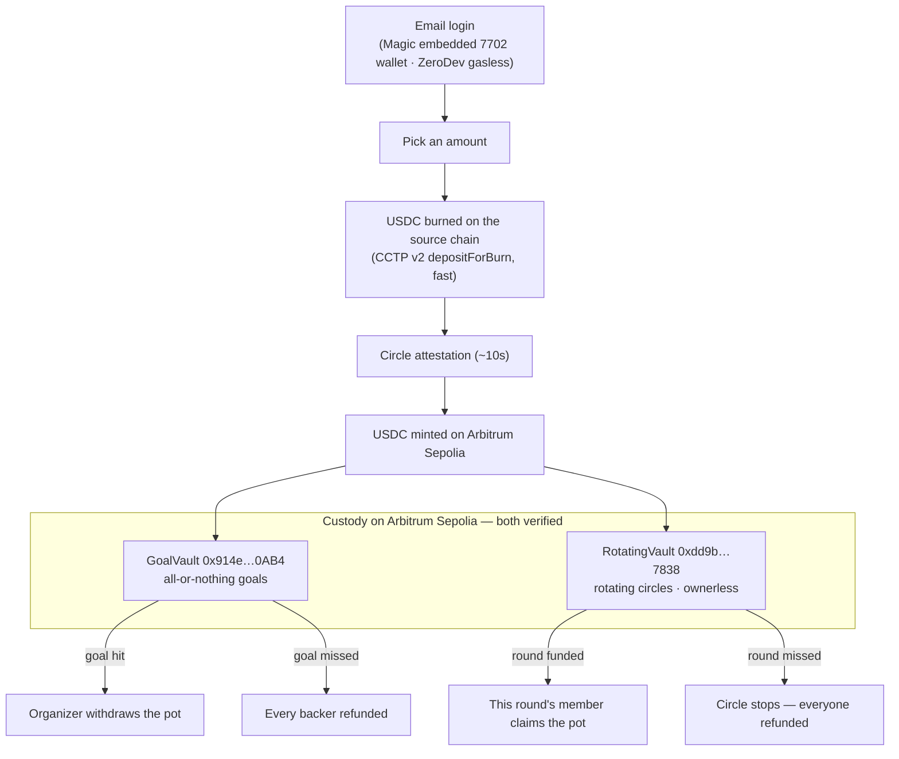

# Rally

**One link. A bar that fills itself from every chain. It pays out together, or refunds everyone — automatically.**

Rally is **conditional group money**. One link lets any group — a trip chat, a family, a savings committee — move money together under a condition the group can see and a contract enforces. Friends open the link, sign in with email, and chip in. The pot either does exactly what the group agreed, or every person gets their money back, automatically. Nobody installs a wallet, pays gas, or picks a network.

> **The thesis:** the money that actually pools is money between people who *know each other* — and nobody owns that primitive. PayPal shut down Money Pools in 2021 and never replaced it. Rotating savings circles (chit funds, tandas, susus) are the largest informal financial instrument on earth and still run on a trusted foreman who can walk off with the pot. Every group-money product before this died of the same thing: *somebody* had to hold the money. Rally's pot is a contract. Nobody holds the money — including us.

**Live:** https://rally-production-94cc.up.railway.app (Goals · Circles switch on the landing)

| Shape | Contract (Arbitrum Sepolia, verified) |
| --- | --- |
| Goals — `GoalVault` | [`0x914e4682aD2FeBb3e00a21dB29B93c16fc080AB4`](https://sepolia.arbiscan.io/address/0x914e4682ad2febb3e00a21db29b93c16fc080ab4#code) |
| Circles — `RotatingVault` (ownerless) | [`0xdd9b3e5F407B99e2C2827695608741B328F97838`](https://sepolia.arbiscan.io/address/0xdd9b3e5f407b99e2c2827695608741b328f97838#code) |

> Testnet only. No real money is ever involved.

---

## Two shapes of the same promise

### Goals — hit it together, or everyone's refunded

One-shot, all-or-nothing. "Send the crew to Tokyo — $2,000 by Friday."

1. An organizer sets a goal and deadline and gets one shareable link (`createCampaign` is permissionless — anyone can start one).
2. Friends open the link, sign in with email, and chip in USDC from whatever chain they hold it on. The bar rises live, colored by the chains the money came from.
3. Goal hit before the deadline → the organizer withdraws one consolidated pot. Missed → **every backer reclaims their contribution.** The escrow tracks each backer's `{sourceDomain, amount}` onchain so refunds can rail back to where the money came from.

### Circles — the pot rotates, every round

A rotating savings circle — the chit fund / tanda / susu, with the foreman replaced by a contract.

1. An organizer starts a circle: N seats, a fixed amount, a round length. Each seat gets a signed invite link; joining is an email login.
2. Every round, everyone chips in the same amount. When the round fills, **one member takes the whole pot** — the turn rotates until everyone has had theirs.
3. Anyone misses a round? The circle stops and **everyone still holding a deposit is refunded, automatically.** No foreman, no ledger notebook, no absconding. The `RotatingVault` is ownerless — there is no admin key that can touch the money.

Same link mechanics, same email login, same refund guarantee. One primitive, two shapes.

---

## Proven onchain (not a mockup)

We'd rather show receipts than adjectives. Everything below is live and verifiable on public explorers.

**Goals**

| What | Value |
| --- | --- |
| Campaign #1 — filled live, cross-chain | [`/c/1`](https://rally-production-94cc.up.railway.app/c/1) — the landing hero reads this exact campaign from Arbitrum over public RPC. Two real CCTP fills (~$6.50 of $30 at submission time), named feed |
| Burn tx (Base) | [`0x297eb6…`](https://sepolia.basescan.org/tx/0x297eb69cf2cac222179de81f58d356822c5ddb663e51c4ce28fed65022fc59bc) |
| Mint tx (Arbitrum) | [`0xc354c2…`](https://sepolia.arbiscan.io/tx/0xc354c2051c70d2e77524ad30dcf9dd31f38466a6fa0456d4c0b8f13a472d1bf1) |
| Measured attestation latency | **9.8 s** (Circle CCTP v2 fast transfer) — fast enough to watch live |
| Campaign #2 — "Coffee for the launch crew" | Opened end-to-end through the product's own [`/create`](https://rally-production-94cc.up.railway.app/create) flow, live at [`/c/2`](https://rally-production-94cc.up.railway.app/c/2) |

**Circles**

| What | Value |
| --- | --- |
| Circle #1 — live, mid-fill | [`/circle/1`](https://rally-production-94cc.up.railway.app/circle/1) — 4 seats · $1/round, created onchain ([tx](https://sepolia.arbiscan.io/tx/0x8db764cb2ab84223cf36bdd361c10652f0ab90c3510a5aa0ff077e81dfaa31b8)), every seat joined via an org-signed EIP-712 invite, round 1 funded 3-of-4 |
| Circle #2 — **broke on schedule, and auto-refunded** | [`/circle/2`](https://rally-production-94cc.up.railway.app/circle/2) — a round went unfunded, the circle derived Broken, and the refund returned a member's deposit: [refund tx](https://sepolia.arbiscan.io/tx/0xdb9d1d5cef7e32ab9040e8f2878d9e80a634fd42d900eeb791e1a0e151729ba6). **The refund rail is proven onchain, not promised.** |

**Assurance**

- **86/86 Foundry tests** across both vaults — GoalVault's 58 (54 unit + 4 invariants incl. `invariant_solvency`) plus RotatingVault's 28, including two fund-conservation fuzzes (green at 2,000+ runs). RotatingVault asserts `balance == Σ deposited − Σ claimed` after every state mutation.
- **Audited twice, independently:** a 12-agent self-audit (Pashov solidity-auditor methodology) and a separate adversarial review — **zero Critical/High/Medium findings.** The remaining Lows are on the roadmap, named.

Full explorer-linked proof and reproduction steps: [`deployments/phase1-live-proof.md`](./deployments/phase1-live-proof.md).

---

## The chain that disappears

The user's entire interaction is *email → amount → done*. Underneath:

1. **Email login → embedded EIP-7702 wallet.** Magic mints the wallet behind the one-time code — no seed phrase, no extension. The 7702 delegation is a real Type-4 transaction with an `authorizationList`, running on a ZeroDev kernel with a paymaster, so every step is gasless.
2. **Chip in from any chain.** Circle CCTP v2 burns the USDC on the source chain, waits ~10 s for Circle's attestation, and mints it on Arbitrum — no bridge UI, no network switch, no gas.
3. **Custody is the two vaults.** Everything on screen — the bar, the pot, the feed, a refund — is read from Arbitrum Sepolia over public RPC.



### Honest caveats (stated, not hidden)

We'd rather a judge hear these from us than find them.

- **Magic OTP is human-in-the-browser.** Email login needs a real person to enter the one-time code. Genuinely gasless and seedless — but not headless.
- **The relayer is a demo concierge.** Fresh email wallets hold no testnet USDC, so in the demo a relayer fronts the source-chain burn (Goals) and holds the organizer seat for circles created in-app. In production each backer burns their own USDC via their sponsored 7702 wallet, and organizers sign for themselves — the CCTP rail, the escrow accounting, and every refund are real either way.
- **Testnet only.** Arbitrum / Base / OP Sepolia with faucet USDC. No mainnet, no real money — by design (see [ROADMAP](./ROADMAP.md) for the mainnet path).

---

## Stack

- **Frontend:** [TanStack Start](https://tanstack.com/start) (React 19 + Vite) + Tailwind CSS v4, Motion for spring physics, canvas-rendered liquid bars
- **Cross-chain rail:** [Circle CCTP v2](https://developers.circle.com/stablecoins/docs/cctp-getting-started) — burn-and-mint USDC across Arbitrum, Base, and OP Sepolia
- **Embedded wallet + gasless:** [Magic](https://magic.link) email login → EIP-7702 embedded wallet; [ZeroDev](https://zerodev.app) kernel + paymaster for sponsored transactions
- **Contracts:** `GoalVault` + `RotatingVault` in Solidity via [Foundry](https://book.getfoundry.sh/), both deployed + verified on Arbitrum Sepolia (86 tests total)
- **Deploy:** [Railway](https://railway.app) (SSR)
- **Package manager:** bun

---

## Prize-track fit

Built for the **UXmaxx / 7702 Collective** hackathon.

- **Arbitrum bounty ($2k)** — the brief asks for consumer apps that "feel less like crypto apps and more like normal consumer products," where the user never thinks about wallets, gas, bridges, or chains. That is Rally's entire design brief. Both vaults live on Arbitrum; every read, payout, and refund settles there. It is the home chain, not an afterthought.
- **Magic bonus ($500)** — email is the front door. The embedded EIP-7702 wallet is what makes "just use your email" possible for a goal *and* a savings circle, without a seed phrase.
- **General Track / ZeroDev subtrack** — gasless 7702 end-to-end on ZeroDev's kernel + paymaster; a Smart Routing Address integration is on the pre-deadline runway (see [ROADMAP](./ROADMAP.md)).

---

## Getting started

```bash
bun install
bun run dev      # http://localhost:3000
```

Other scripts:

```bash
bun run build    # production build
bun run start    # serve the production build
bun run test     # run the test suite
```

Create a `.env.local` with the following keys before running against live testnet services (all free, all testnet):

```
VITE_MAGIC_PUBLISHABLE_KEY=     # Magic — email login + EIP-7702
VITE_ZERODEV_PROJECT_ID=        # ZeroDev — gasless 7702 (Arbitrum Sepolia)
CIRCLE_API_KEY=                 # Circle — CCTP v2 + testnet USDC faucet
ALCHEMY_API_KEY=                # Alchemy — RPC for Arbitrum/Base/OP Sepolia
ARBISCAN_API_KEY=               # Arbiscan — contract verification
```

### Contracts

Solidity contracts live in [`contracts/`](./contracts) and use [Foundry](https://book.getfoundry.sh/).

```bash
cd contracts
forge build
forge test       # 86 tests: GoalVault + RotatingVault + invariants
```

### Project layout

```
src/routes/        index (Goals landing) · circles.index (Circles landing) · create ·
                   circles.new · c.$id (live campaign) · circle.$id (live circle) · invite
src/components/    thermometer + round bar, contribute/circle sheets, feeds, celebrations
src/lib/           auth (Magic), cctp (Circle rail), campaign + circle read/write models
src/design/        design tokens + chain brand colors
contracts/         Foundry project (GoalVault + RotatingVault)
deployments/       onchain proof + deployed addresses
```

---

## What's next

Both shapes work end-to-end today. The near-term plan — the Jul 19 submission runway, then Circles for the people who already run savings committees — lives in [**ROADMAP.md**](./ROADMAP.md). A beat-by-beat demo script is in [**PITCH.md**](./PITCH.md).

## License

MIT
