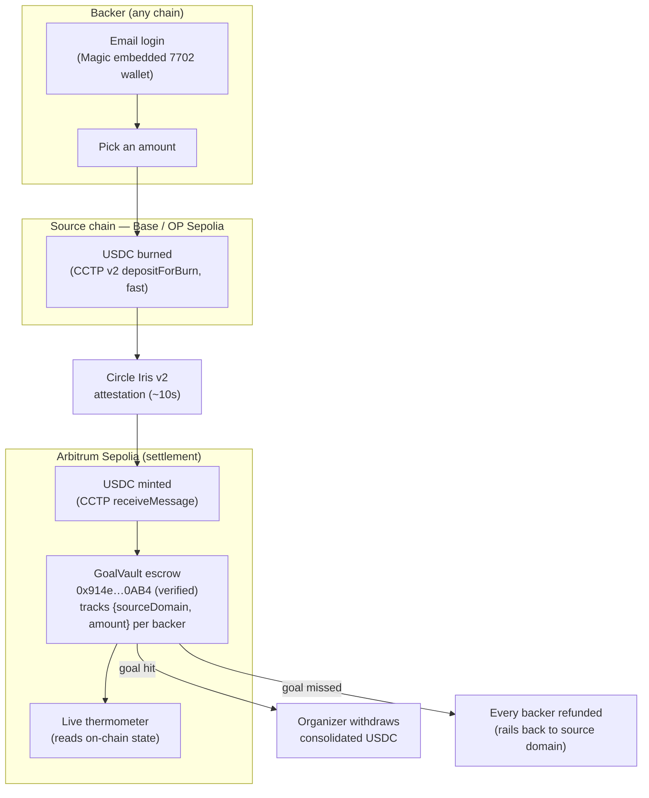

# Rally

**One link. A bar that fills itself from every chain. Hit the goal, or everyone gets their money back.**

Rally is cross-chain crowdfunding where the chain disappears. You share a link; friends log in with email and chip in whatever USDC they hold, on whatever chain they hold it; the money quietly rails onto Arbitrum and a live thermometer rises in real time. Hit the goal and the organizer withdraws the consolidated funds. Miss it and every backer is refunded. All-or-nothing, no seed phrases, no bridge UI, no "which network am I on?"

> **The thesis:** crowdfunding is a social act, not a crypto act. The best onchain UX is the one nobody notices. Rally turns a group chat into onchain contributors through a single link — the cross-chain plumbing is invisible, the rising bar is the whole product.

**Live:** https://rally-production-94cc.up.railway.app
**Contract (Arbitrum Sepolia, verified):** [`0x914e4682aD2FeBb3e00a21dB29B93c16fc080AB4`](https://sepolia.arbiscan.io/address/0x914e4682ad2febb3e00a21db29b93c16fc080ab4#code)

> Testnet only. No real money is ever involved.

---

## How it works

1. **Start a rally.** An organizer sets a goal and deadline and gets one shareable link. The campaign is a permissionless `createCampaign` call — anyone can start one.
2. **Log in with email.** A backer opens the link and signs in with their email address. Magic mints an embedded EIP-7702 wallet behind the scenes — no seed phrase, no extension, no "download a wallet" wall.
3. **Chip in from any chain.** The backer contributes USDC from whatever testnet chain they already hold it on — Base, Optimism, Arbitrum. They pick an amount. That's the entire interaction.
4. **The chain disappears.** Under the hood, Circle CCTP v2 burns the USDC on the source chain, waits for Circle's attestation (~10s, fast transfer), and mints it into the `GoalVault` escrow on Arbitrum Sepolia. The backer never sees a bridge, never approves a network switch, never touches gas.
5. **The bar rises — for real.** The thermometer fills live, colored by the chains the money came from. You can literally see that "half came from Optimism" in the band heights.
6. **All-or-nothing.** Goal hit before the deadline → the organizer withdraws consolidated USDC. Goal missed → every backer reclaims their contribution. The escrow tracks each backer's `{sourceDomain, amount}` on-chain so refunds can rail back to where the money came from.

---

## Proven on-chain (not a mockup)

This is not a coming-soon. A real Circle CCTP v2 cross-chain USDC transfer (Base Sepolia → Arbitrum Sepolia) has already landed in the deployed, Arbiscan-verified `GoalVault` and moved a real campaign's thermometer.

| What | Value |
| --- | --- |
| Cross-chain fill | Base Sepolia → Arbitrum Sepolia, live |
| Campaign #1 raised | 0 → **4.99935 USDC** (5 USDC burned, minus the 1.3 bps CCTP fast-transfer fee) |
| Measured attestation latency | **9.8 s** (Circle Iris v2 fast transfer) — fast enough for a live demo |
| Burn tx (Base) | [`0x297eb6…`](https://sepolia.basescan.org/tx/0x297eb69cf2cac222179de81f58d356822c5ddb663e51c4ce28fed65022fc59bc) |
| Mint tx (Arbitrum) | [`0xc354c2…`](https://sepolia.arbiscan.io/tx/0xc354c2051c70d2e77524ad30dcf9dd31f38466a6fa0456d4c0b8f13a472d1bf1) |
| Record tx (Arbitrum) | [`0xe3e115…`](https://sepolia.arbiscan.io/tx/0xe3e115f33c3f1996dbe25321130fc054d72370194d606c6652c9fdb218eed91d) |

Full explorer-linked proof, spend log, and reproduction steps: [`deployments/phase1-live-proof.md`](./deployments/phase1-live-proof.md).

The `/c/1` route on the live site reads this exact campaign from Arbitrum Sepolia over a public RPC — the bar you see filling is on-chain state.

---

## Architecture



### Honest caveats (stated, not hidden)

We'd rather a judge hear these from us than find them.

- **Magic OTP is human-in-the-browser.** Email login requires a real person to enter the one-time code in the browser. It's genuinely gasless and seedless, but it is not a headless flow — the demo has a human do the login step.
- **The relayer fronts source USDC in the demo.** A freshly-created email wallet has no testnet USDC of its own, so for the live demo a testnet relayer funds the burn on the source chain and records the contribution under the backer's Magic address. **In production, each backer burns their own USDC** via their ZeroDev-sponsored 7702 wallet — the relayer is a demo convenience, not an architectural dependency. The CCTP rail, the escrow accounting, and the thermometer are all real either way.
- **Testnet only.** Everything runs on Arbitrum Sepolia / Base Sepolia / OP Sepolia with free faucet USDC. No mainnet, no real money — by design (see [ROADMAP](./ROADMAP.md) for the mainnet path).

---

## Stack

- **Frontend:** [TanStack Start](https://tanstack.com/start) (React 19 + Vite) + Tailwind CSS v4, Motion for spring physics, a canvas-rendered liquid thermometer
- **Cross-chain rail:** [Circle CCTP v2](https://developers.circle.com/stablecoins/docs/cctp-getting-started) — burn-and-mint USDC across Arbitrum, Base, and OP Sepolia (Solana Devnet on the roadmap)
- **Embedded wallet + gasless:** [Magic](https://magic.link) email login → EIP-7702 embedded wallet; [ZeroDev](https://zerodev.app) paymaster for sponsored (gasless) transactions
- **Contracts:** `GoalVault` escrow in Solidity via [Foundry](https://book.getfoundry.sh/), deployed + verified on Arbitrum Sepolia (58 tests: 54 unit + 4 invariants incl. `invariant_solvency`)
- **Deploy:** [Railway](https://railway.app) (SSR)
- **Package manager:** bun

---

## Prize-track fit

Built for the **UXmaxx / 7702 Collective** hackathon.

- **General Track ($2k)** — a consumer product that happens to be onchain. UX is 40% of the score; Rally makes the chain vanish behind a rising bar.
- **Arbitrum bounty ($2k)** — the `GoalVault` escrow is deployed and verified on Arbitrum Sepolia; every contribution settles on Arbitrum. It is the home chain, not an afterthought.
- **Magic bonus ($500)** — email login is the front door. The embedded EIP-7702 wallet is what makes "just use your email" possible without a seed phrase.

---

## Getting started

```bash
bun install
bun run dev      # http://localhost:3000
```

Other scripts:

```bash
bun run build    # production build
bun run start    # serve the production build
bun run test     # run the test suite
```

Create a `.env.local` with the following keys before running against live testnet services (all free, all testnet):

```
VITE_MAGIC_PUBLISHABLE_KEY=     # Magic — email login + EIP-7702
VITE_ZERODEV_PROJECT_ID=        # ZeroDev — gasless 7702 (Arbitrum Sepolia)
CIRCLE_API_KEY=                 # Circle — CCTP v2 + testnet USDC faucet
ALCHEMY_API_KEY=                # Alchemy — RPC for Arbitrum/Base/OP Sepolia
ARBISCAN_API_KEY=               # Arbiscan — verify the goal-vault contract
```

### Contracts

Solidity contracts live in [`contracts/`](./contracts) and use [Foundry](https://book.getfoundry.sh/).

```bash
cd contracts
forge build
forge test
```

### Project layout

```
src/routes/        file-based routes (index = landing, create, c.$id = live campaign)
src/components/     thermometer, contribute sheet, contributor feed
src/lib/           auth (Magic), cctp (Circle rail), contribute server fn
src/design/        design tokens + chain brand colors
contracts/         Foundry project (GoalVault escrow)
deployments/       on-chain proof + deployed addresses
```

---

## What's next

Rally works end-to-end today. The near-term plan — gasless 7702 from each backer, more CCTP chains, the Potluck gift mode, an Expo mobile app, and mainnet — lives in [**ROADMAP.md**](./ROADMAP.md). A beat-by-beat demo script is in [**PITCH.md**](./PITCH.md).

## License

MIT
