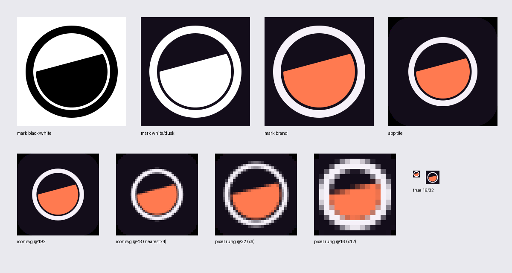
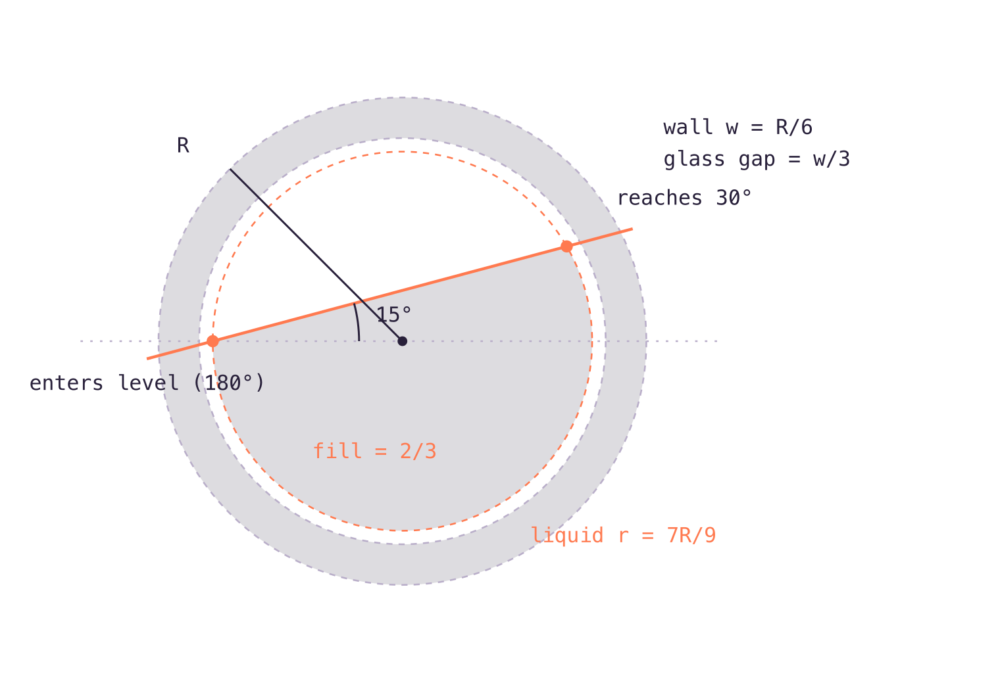
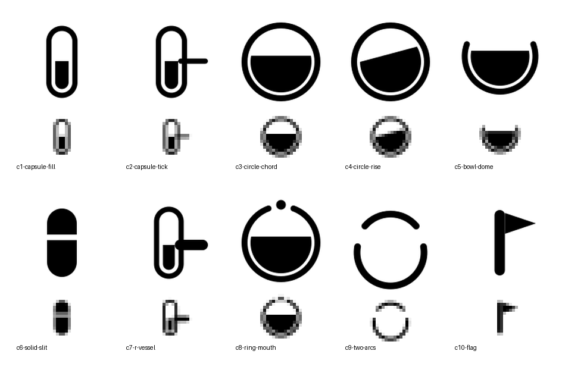

# The Rally Mark — Construction Sheet

Rally's one idea is **the vessel that fills**: a group pools money into one
place; when it's full it pays out together, otherwise everyone is refunded.
The mark is that idea reduced to constructed geometry — two elements, no
decoration.

- **The circle** is the vessel: the pool, the coin, the group standing in a
  round.
- **The solid segment** is the pooled money. Its meniscus is not level — it
  **rises at exactly 15°**, because the mark holds the moment of filling, not
  a resting state. A rally, not a balance.

The fill sits at **two-thirds** — past halfway, before the payout. That is
the emotional register of the product: momentum with the condition still
open.

## Construction

Every dimension derives from one number, the vessel radius **R**. Nothing is
freehand.

| element | rule | at R = 216 (mark master) | at R = 162 (app tile) |
| --- | --- | --- | --- |
| vessel wall | `w = R/6` | 36 | 27 |
| wall stroke path | `R − w/2` | 198 | 148.5 |
| glass gap | `w/3` | 12 | 9 |
| liquid radius | `R − w − w/3 = 7R/9` | 168 | 126 |
| meniscus chord | from **180°** to **30°** on the liquid circle | (88, 256) → (401.49, 172) | (130, 256) → (365.12, 193) |
| meniscus angle | `(180° − 30°)/2 − 60° = 15°` | 15° | 15° |
| fill | segment below the chord | 66.3% ≈ **2/3** | 66.3% ≈ **2/3** |

The chord's two endpoints are themselves constructed points: the liquid
**enters level at the waterline** (the 180° point — the horizontal diameter)
and **reaches for the rim at 30°**. By the inscribed-angle relation the
meniscus inclines at exactly half the difference: 15°. The 15° line is also
the identity's application datum — the OG poster reuses it as its layout
axis (see below).

### The masters' constraints, applied

- **Stankowski (structure carries meaning):** the mark is two flat shapes.
  In pure black on white it loses nothing — the geometry *is* the message.
  No gradient, no glow, no highlight anywhere in the identity.
- **Loewy (stated geometry):** the table above is the whole drawing. Wall
  R/6, gap w/3, liquid 7R/9, chord 180°→30°. A contractor could redraw it
  from this paragraph.
- **Rams (nothing without a reason):** the glass gap is not a style — it is
  the vessel wall *containing* the liquid, and it is what makes the mass
  read as contents rather than a pie slice. The tilt is not a style — it is
  the verb "filling."
- **Shell (the size ladder):** small sizes get an optical variant, not a
  shrunk master. See below.

## The size ladder

| context | file | geometry |
| --- | --- | --- |
| ≥ 48 px (app tile, PWA icons, OG) | `public/icons/icon.svg` | master: R = 162 in the 512 tile, glass gap intact |
| maskable (Android/iOS PWA, apple-touch) | `public/icons/icon-maskable.svg` | full-bleed dusk, R = 150 (inside the 80% safe zone) |
| header lockup (~18 px, retina) | `src/components/Brand.tsx` | wall one step heavier (`R/5`), glass gap kept — retina renders it |
| 32 px tab | `public/favicon-32.png` (`icons/favicon.svg` is the same drawing) | **pixel rung, redrawn on the 32-grid**: ring edges on integer pixels (outer 12.5, wall 2, gap 1, liquid 9.5); meniscus snapped to a **1:4 stair** (14.04°) |
| 16 px tab | `public/favicon-16.png` | **pixel rung, redrawn on the 16-grid**: 2 px ring (edges 5/7), gap dropped, liquid r = 5, 1:4 meniscus |

Below 48 px the constructed clearances stop being spatial decisions and
become anti-aliasing noise (the master's `w/3` gap is under half a pixel at
16). So the small rungs are not scaled vectors — they are **redrawn on the
pixel grid**, the way Shell's smallest shell is its own drawing. The 1:4
stair is the pixel-honest neighbor of 15° (`atan(1/4) = 14.04°`), and both
chord–circle intersections land on rational points (`√92416 = 304`,
`√25600 = 160`) — the pixel rungs are still constructed, just in the
raster's own arithmetic.

## The rejected sheet

Ten genuinely different constructions were drawn and judged **at 16 px**
(bottom row of each cell — nearest-neighbor, no mercy):

| candidate | why it lost |
| --- | --- |
| c1 capsule-fill | honest, but spindly in a square frame; reads "battery" |
| c2 capsule-tick | the goal-tick (the *condition*) is the best story on the sheet, but it dies at 16 px |
| c3 circle-chord | the runner-up — full use of the frame, instantly legible, but a horizontal fill is a *state*: moon phase, half-full icon, generic |
| c4 circle-rise | **winner** — c3's legibility plus the verb: the tilt survives even at 16 px |
| c5 bowl-dome | reads sunset/sad-face; the vessel disappears |
| c6 solid-slit | bold but reads "pill", and solid-above-the-line lies about the idea |
| c7 r-vessel | letterform ambition, but three competing weights; the arm smudges at 16 px |
| c8 ring-mouth | the entering coin is decoration; the dot is gone at 16 px |
| c9 two-arcs | portal, not vessel; no money in it |
| c10 flag | "rally point" pun; loses the product's one idea and lands on a map-marker cliché |

c4 won the argument, not just the beauty contest: it is the only candidate
where **the vessel, the money, and the act of filling** are all present in
two shapes that survive a browser tab.

## Paint

Flat, always. The mark never carries a gradient — the in-app thermometer is
the only liquid that glows.

| role | token | hex |
| --- | --- | --- |
| canvas | `--color-ink-950` | `#130d1a` |
| vessel wall | `--color-paper` | `#f6f1f9` |
| liquid | `--color-rally-500` | `#ff7a50` |
| black test | — | `#000000` on white / `#ffffff` on dusk |

## Applications

- **Header lockup** (`src/components/Brand.tsx`): mark at 18 px, ring on
  `currentColor` at the heavier UI wall (`R/5`), wordmark in Clash Display
  600 `text-lg tracking-tight` — the same rhythm the text-only wordmark
  had. The mark is aligned to the cap-height mass of "Rall" (1 px lift —
  the y-descender would drag a box-centered mark low); gap 6 px.
- **OG poster** (`public/og.png`, 1200×630): the mark's meniscus extends
  across the canvas as a coral datum at 15°, and the region below the line
  is one step lighter — the poster itself is two-thirds full. Wordmark +
  the one-liner sit inside the filled region. Verified at 440 px and 360 px
  (Discord/Slack unfurl sizes).
- **Splash** (`scripts/gen-splash.mjs`): dusk canvas, mark at 31% of the
  short edge, wordmark, "Conditional group money."

## Files

| file | purpose |
| --- | --- |
| `public/icons/icon.svg` | master app tile (manifest `any`, ≥48px contexts) |
| `public/icons/favicon.svg` | the 32-grid pixel rung (linked as the SVG favicon) |
| `public/icons/icon-maskable.svg` | full-bleed maskable source |
| `public/icons/icon-{192,512}.png`, `icon-maskable-{192,512}.png` | manifest rasters (from the SVGs, via rsvg) |
| `public/icons/apple-touch-icon.png` | 180×180, from the maskable source |
| `public/favicon-32.png`, `public/favicon-16.png` | pixel-rung tab rasters |
| `public/og.png` | the unfurl poster |

## The review round

The family was put through an adversarial vision review (Fugu Ultra,
prompted as a modernist identity designer) and iterated on its verdicts:

- *"The large mark is rational. The small mark is not yet engineered"* —
  the 16/32 px rungs were redrawn on the pixel grid (table above) instead
  of rasterizing the master.
- *"The lockup reads assembled, not locked up"* — gap tightened by a
  third, mark aligned to cap-height mass instead of the bounding box,
  wall stepped up to `R/5` at UI size.
- *"The datum line is doing conceptual work but rendered too delicately"*
  — OG datum thickened to 3.5 px, field split strengthened one step, and
  the near-tangent with the wordmark's "R" opened up.
